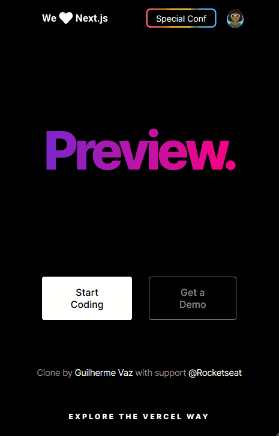
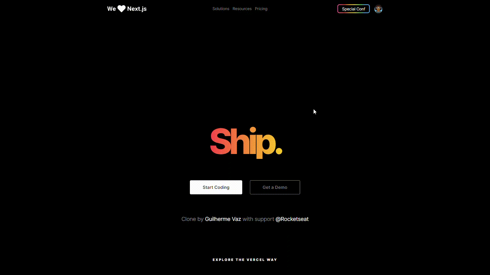

# UI Clone Vercel Homepage
# Sobre | About:
Clone da homepage do Vercel usando HTML/SCSS| Vercel Interface clone using  HTML / CSS

## Ferramentas usadas | Used tools:

Uso HTML/CSS  | Use HTML / CSS

## Como foi desenvolvido | How it was developed:

Através de um vídeo disponibilizado no canal da rocketseat, pude acompanhar o passo a passo e fazer alterações que fossem de meu interesse! 
Through a video available on the rocketseat channel, I was able to follow the step by step and make changes that were of interest to me!

## Alterações | Changes:
Com base no layout para Desktop, pude fazer algumas alterações e adicionar responsividade no layout! 
Based on the Desktop layout, I was able to make some changes and add responsiveness to the layout!

## Versão Mobile | Version Mobile:

## Versão Desktop | Version Desktop:

## Agradecimentos | Thanks:
[Rocketseat](https://www.youtube.com/watch?v=XdqD8qi44Cg&t=2s) 
[Guilhermerodz](https://github.com/guilhermerodz)
